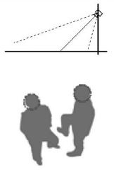
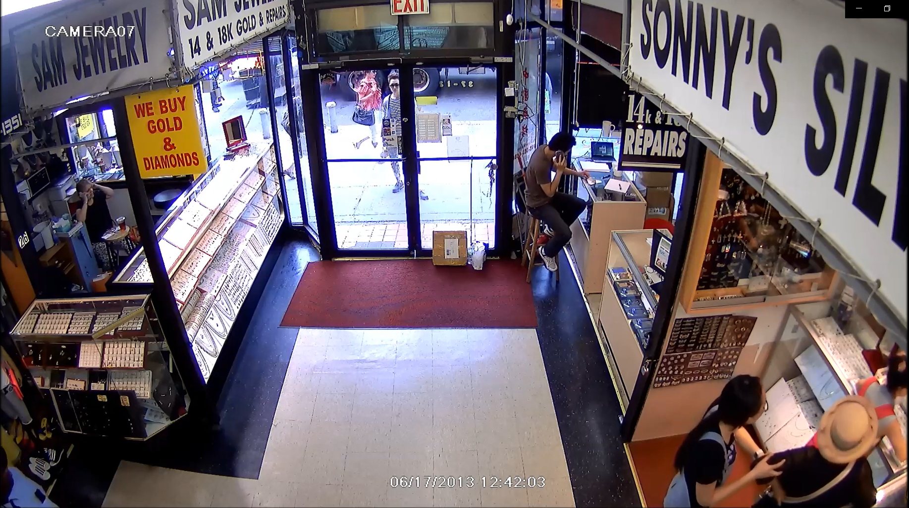
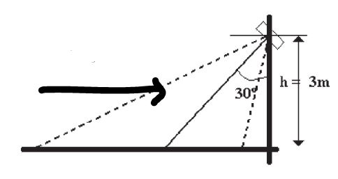
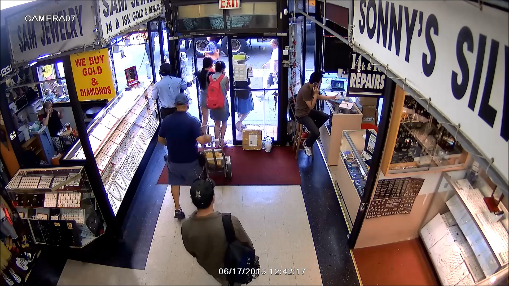

# PC-CV_ITB20_Database
This page provides information for gathering determined videos and images that used for creating computer vision database in ITB.

Purpose:
1. Gathering determined videos and images for creating ITB computer vision database.
2. Guidance for contributors to share their videos which meet the criteria
3. Empowering research in computer vision especially in counting people

Duration:
This project will run as long as the research still relevant and database will be updated periodically

Information Gathering:
1. Contributors

2. Video Requirements
Video should meet the criteria.\
   a. The origin of the video\
   The video should be a legal video.\
   The video taken from entrance gate, coridor (should meet the frame information's requirements), and other places as many as you could find.\
   b. Quality\
   The video should have a good quality (no corrupted file)\
   No virus infected files\ 
   c. Camera positioning\
   Video should taken from inclined camera.
\
   Example:\
\
taken from : HDSecurityStore. url:https://www.youtube.com/watch?v=-IvBKBx0UBo&t=66s \
\
   d. Frame rates per second
   The videos sould have more than 12 fps.
   e. File's format
   For uniformity purposes, the videos should in mp4/avi format.
3. Frame's Information\
   a. Object Flows\
\
   Example:\

taken from : HDSecurityStore. url:https://www.youtube.com/watch?v=-IvBKBx0UBo&t=66s \
\
   b. Inside the frame should contain information about the image of people, in and out scenario, and other scenario as many as you could find.\
   c. The lighting should be good enough to see by human eye (no backlight)\
4. Uploading Video\
   For all contributors, can contact me (en.nanangcahyadi@gmail.com) for sending the videos. And check out the dataset here()
   
